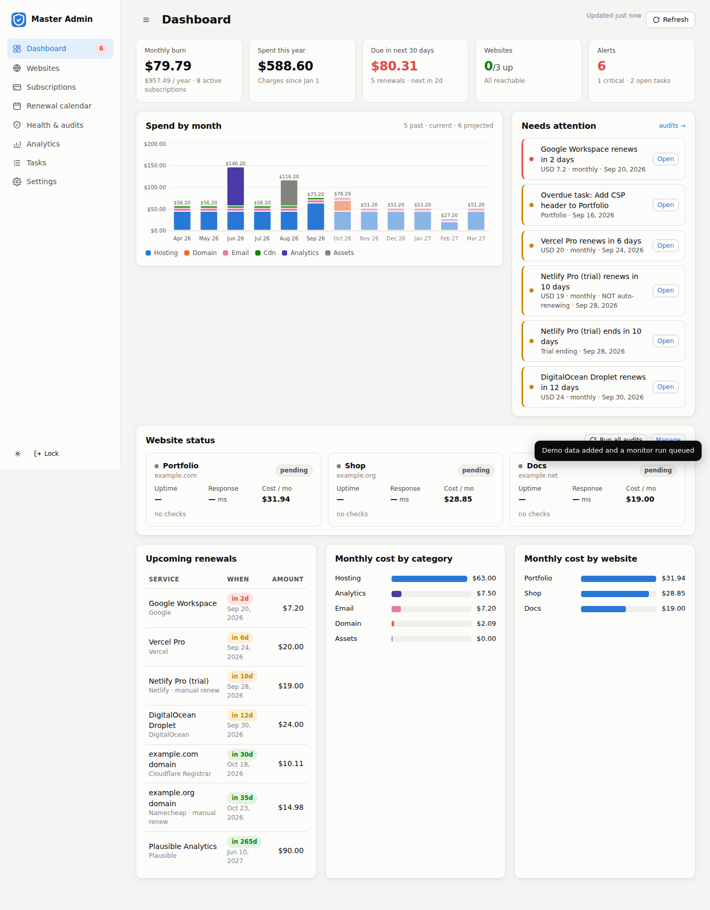

# Master Admin Panel

One private dashboard for everything you run on the web: **what it costs, when it renews, whether it is up, how healthy it is.** No server, no third-party host. The page is static, the data is JSON on a branch of this repository, and the monitoring runs in GitHub Actions.



## How it works

| Piece | Where it runs | What it does |
|---|---|---|
| `index.html`, `app.js`, `views.js` | Your browser, served as static files by the site deploy at `/master-admin-panel/` | The whole UI. Reads and writes JSON through the GitHub API with a fine-grained token you paste once. |
| `panel-data` branch, folder `panel/` | GitHub | `sites.json` (plain), `vault.json` (subscriptions, tasks, settings, **AES-256 encrypted in the browser**), `audits.json`, `checks.json`, `notified.json` (written by the monitor). Every change is a commit, so you get history for free. |
| `.github/workflows/panel-monitor.yml` + `scripts/monitor.js` | GitHub Actions | Probes every site on a schedule, runs the full audit every N hours, commits results, and sends new alerts to a webhook and/or opens GitHub issues. Same relay pattern as `monitor-data.yml`. |

Because the vault is encrypted before it is committed, the repository can stay public. Sites, audit results and uptime history are stored in plain JSON since the monitor needs to read them; they contain nothing you would not put on a status page.

## What it does

- **Expenses & subscriptions** — hosting, domains, SaaS, APIs, email, CDN… with amount, currency, billing cycle, start / next-renewal / end dates, auto-renew flag, payment method and linked websites. Monthly burn, yearly cost, year-to-date spend, spend by month (past + projected), by category and by website.
- **Renewal calendar** — every charge for the next six months, grouped by day; trials and manual renewals flagged.
- **Website health audits** — HTTP status and response time, TLS issuer and expiry, DNS records, domain registrar and expiry via RDAP, security headers, SEO basics, robots.txt / sitemap.xml, page weight, mixed content; a 0–100 score with a findings list.
- **Uptime** — probe history, uptime %, response-time chart and sparklines per site.
- **Alerts** — renewals due, trials ending, sites down, TLS or domain expiring, low scores, overdue tasks. Shown on the dashboard; the monitor pushes new ones to Slack / Discord / any webhook and can open a GitHub issue per alert.
- **Analytics** — one-click links to each site's provider (Cloudflare Web Analytics, Plausible, GA4, Umami…). There is no server to receive pageviews in this setup.
- **Tasks**, JSON export / import, dark mode, mobile layout.

## Setup (once)

1. **Merge** this folder and `.github/workflows/panel-monitor.yml` to `main`. The site deploy publishes the panel at `https://strykertrading.com/master-admin-panel/`.
2. **Create a token**: GitHub → Settings → Developer settings → Personal access tokens → *Fine-grained tokens* → Generate. Repository access: *Only select repositories* → this repo. Permissions: **Contents: Read and write**, **Actions: Read and write** (Metadata: read is added automatically).
3. **Open the panel**, paste the token, tick *Remember* if this is your own device, and choose a **vault password** (8+ characters). The password encrypts your financial data and is never stored anywhere; if you lose it the vault cannot be recovered, though sites and audits are unaffected.
4. Optional alerts: repository **Settings → Secrets and variables → Actions** → secret `PANEL_ALERT_WEBHOOK_URL` (Slack / Discord / JSON endpoint) and/or variable `PANEL_ALERT_ISSUES` = `1`.
5. Press **Run monitor now** in Settings (or wait for the hourly cron). Results appear within a couple of minutes.

`config.js` names the repository, data branch, folder and workflow; change it there if you move the panel.

## Day to day

Add websites by URL; each one is audited on the next monitor pass. Add subscriptions with amounts and renewal dates and link them to sites. Everything you save is a commit on `panel-data`. **Lock** in the sidebar forgets the vault password; *Forget token on this device* in Settings removes the token from the browser.

## Development

```bash
cd master-admin-panel
npm test                 # unit tests for cost maths and audit scoring
python3 -m http.server   # serve the static UI locally (talks to the real GitHub API)
GITHUB_REPOSITORY=owner/repo GITHUB_TOKEN=… node scripts/monitor.js   # one monitor pass
```

## Layout

```
index.html, style.css     static shell and styles
config.js                 repo / branch / workflow names
app.js                    core: templating, charts, modal, router, GitHub sign-in, vault unlock
views.js                  dashboard, websites, subscriptions, calendar, audits, analytics, tasks, settings
api.js                    the "backend" in the browser: routes, summary maths, GitHub persistence
gh.js                     GitHub REST client (contents, branches, workflow dispatch)
crypto.js                 PBKDF2 + AES-GCM vault encryption (WebCrypto)
lib/money.js              cost normalisation, renewal and charge-calendar maths (browser + Node)
lib/alerts.js             alert derivation + webhook delivery (browser + Node)
lib/audit.js              site audit engine (Node, used by the monitor)
lib/seed.js               demo data
scripts/monitor.js        GitHub Actions entry point
test/                     node:test unit tests
```
